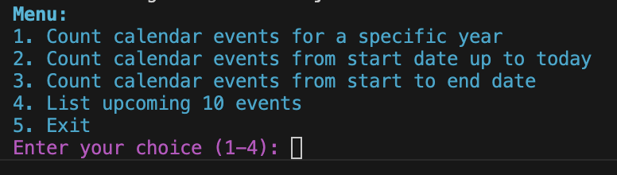

# Windfire Calendar
This project manages Google calendar interactions using Pythong programs that wrap Google APIs.

## Activate Python Virtual Environment
The project makes use of Python Virtual Environment, which is a fully self-contained development environment, complete with its own Python interpreter, libraries, and required dependencies. This creates a separate “mini” Python setup that’s completely isolated from the system-wide Python installation and any other virtual environments you may have.

This allows to run python programs in an environment that is virtually segregated from the host: have a look at https://www.hostinger.com/tutorials/how-to-create-a-python-virtual-environment for more information.

Some convenient scripts are provided to facilitate the creation and activation of Python Virtual environment:
* **[createPythonVenv.sh](createPythonVenv.sh)** : it creates the Python Virtual Environment; this basically just creates a subfolder *google-calendar* (this can be set in **[setVars.sh](setVars.sh)** script) under the project root, where all the Python interpreter, libraries, and required dependencies will be placed.
* **[activatePythonVenv.sh](activatePythonVenv.sh)** : it activates Python Virtual Environment; the script is "smart" enough to first create the virtual environment, if it does not exists 
* **[installPrereqs.sh](installPrereqs.sh)** : it download all the python modules that the project needs to work correctly, run it only after having activated the Virtual environment.

## Run the application
The application is a very simple, command line based kind of application: to run it just launch **[run-calendar.sh](run-calendar.sh)** script.

The program will just present the following menu, exposing to the user 4 different query functions

By selecting the appropriate menu options, the user will be able to
* get the count of calendar events for a specific year 
* get the count of calendar events from a specific date up to today
* get the count of calendar events between two specific dates
* get the count of the next 10 events in calendar