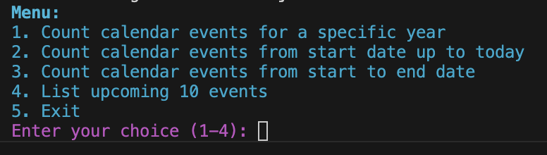

# Windfire Calendar
Windfire Calendar is a Python application that wraps the Google Calendar API to query events on the **primary** calendar of a Google account. The main use case is counting how many times an event with a given title (e.g. *"Palestra"*) occurred in a period.

The same business logic is exposed in two ways:
* a **terminal application** ([app/calendarMgr.py](app/calendarMgr.py)) with an interactive, colored menu
* a secured **REST API** ([app/calendarApiServer.py](app/calendarApiServer.py)) built with FastAPI, protected by Bearer tokens verified against a Keycloak-backed Windfire Security service

The repository also includes a test client for the REST API, scripts to generate TLS certificates, and Ansible playbooks to deploy the service to a Raspberry Pi.

## Table of contents
- [Repository structure](#repository-structure)
- [Prerequisites](#prerequisites)
- [Python Virtual Environment](#python-virtual-environment)
- [Configuration](#configuration)
- [Configure Google Calendar API credentials](#configure-google-calendar-api-credentials)
- [Run the terminal-based application](#run-the-terminal-based-application)
- [Run the REST API service](#run-the-rest-api-service)
- [Test the REST API](#test-the-rest-api)
- [TLS certificates](#tls-certificates)
- [Deploy to Raspberry Pi](#deploy-to-raspberry-pi)

## Repository structure
```
windfire-calendar/
├── common.sh                     # shared shell variables and functions (colors, environment/platform selection, credential prompts)
├── app/                          # application code (run all app scripts from this folder)
│   ├── calendarMgr.py            # terminal application entry point
│   ├── calendarApiServer.py      # FastAPI server entry point
│   ├── apiRouter.py              # /v1 router, aggregates the routers below
│   ├── routers/                  # healthRouters.py (/v1/monitor), calendarRouters.py (/v1/calendar)
│   ├── services/calendarService.py  # Google OAuth + Google Calendar API calls
│   ├── handler/actionHandler.py  # terminal input handling and output
│   ├── models/calendarModels.py  # Pydantic request/response models
│   ├── commons.py                # Bearer token verification dependency
│   ├── middlewares.py            # HTTPS enforcement and security headers
│   ├── config/settings.py        # reads configuration from .env
│   ├── logger/loggerFactory.py   # file logger with daily rotation
│   ├── utils/dateMgr.py          # date helpers
│   ├── ssl/                      # server certificate generation script and OpenSSL configs
│   ├── .env_PLACEHOLDER          # template for app/.env
│   └── *.sh                      # venv, run, start/stop scripts
├── test/                         # REST API test suite (test.py + scripts)
├── deployment/                   # deploy.sh / undeploy.sh for Raspberry Pi
│   └── raspberry/                # Ansible playbooks, conf/config.yaml, tasks/ (shared deploy tasks), templates/ (.env and systemd unit)
└── img/                          # images used by this README
```

## Prerequisites
* **Python 3** with the `venv` module
* A **Google account** and a Google Cloud project with the Google Calendar API enabled (see [Configure Google Calendar API credentials](#configure-google-calendar-api-credentials))
* The **windfire-security-client** Python package (module `client.authClient`), used by the REST API and by the test client to authenticate and verify tokens. The install scripts expect it:
  * in **development/test**: as source code in `$HOME/dev/windfire-security-client` (installed in editable mode, `pip install -e`)
  * in **production** (environment option `3`): as a wheel in `$HOME/dist/client-1.0.0-py3-none-any.whl`
* For the REST API: a reachable **Keycloak** / Windfire Security service and its client secret
* For HTTPS: the **Windfire Root CA** key and certificate (see [TLS certificates](#tls-certificates))
* For deployment: **Ansible** and SSH access to the Raspberry Pi

## Python Virtual Environment
The project uses Python Virtual Environments, so that all Python dependencies are isolated from the system-wide installation. Have a look at https://www.hostinger.com/tutorials/how-to-create-a-python-virtual-environment for more information.

The virtual environment names are defined in [common.sh](common.sh):
* `windfire-calendar` (created under `app/`) for the application
* `windfire-calendar-test` (created under `test/`) for the test client

All scripts `source ../common.sh`, so they must be run **from their own folder** (e.g. `cd app` before running app scripts).

The following scripts are available in [app/](app/) (with equivalent versions in [test/](test/)):
* **[createPythonVenv.sh](app/createPythonVenv.sh)**: creates the virtual environment if it does not exist, activates it and installs the prerequisites
* **[activatePythonVenv.sh](app/activatePythonVenv.sh)**: activates an existing virtual environment
* **[installPrereqs.sh](app/installPrereqs.sh)**: installs the pinned Python modules (Google API client and OAuth libraries, FastAPI, Uvicorn, Pydantic, PyJWT, colorama, python-dateutil, cryptography) and the custom windfire-security-client module. Pass `3` as argument to install the production wheel instead of the editable source
* **[deactivatePythonVenv.sh](app/deactivatePythonVenv.sh)**: prints the command to deactivate the environment

The run scripts described below call `createPythonVenv.sh` automatically, so usually you don't need to run these scripts yourself. Note that the app version reinstalls prerequisites on every run, while the test version installs them only when it creates the virtual environment. To leave a virtual environment, type **deactivate** in the terminal.

## Configuration
Configuration is read from **app/.env** (loaded with python-dotenv). Copy [app/.env_PLACEHOLDER](app/.env_PLACEHOLDER) to `app/.env` and set the values; `.env` is gitignored, so never commit real secrets.

| Variable | Description |
|---|---|
| `APP_NAME` | Service name, shown in the API docs and in the health response |
| `API_HOST` | Address the API server binds to (e.g. `0.0.0.0`) |
| `API_PORT` | HTTP port (default in template: `8000`) |
| `API_PORT_SECURE` | HTTPS port, used when HTTPS is enabled (default in template: `8443`) |
| `SSL_KEYFILE` / `SSL_CERTFILE` | Server private key and certificate paths, e.g. `./ssl/windfire-calendar.key` / `./ssl/windfire-calendar.crt` |
| `ENFORCE_HTTPS` | `true` to serve over HTTPS and redirect HTTP requests to HTTPS; `false` for plain HTTP (development only) |
| `ALLOWED_HOSTS` | Comma-separated list used both as CORS origins and as trusted hosts (trusted host check is skipped when set to `*`) |
| `KEYCLOAK_DEV_HOST` / `KEYCLOAK_DEV_PORT` | Development Keycloak / Windfire Security auth server (default `localhost:8444`) |
| `KEYCLOAK_TEST_HOST` / `KEYCLOAK_TEST_PORT` | Test Keycloak / Windfire Security auth server (default `localhost:8444`) |
| `KEYCLOAK_PROD_HOST` / `KEYCLOAK_PROD_PORT` | Production Keycloak / Windfire Security auth server (default `raspberry01:8444`) |
| `KEYCLOAK_SERVICE` | Service (client) name used when verifying Bearer tokens |
| `DEFAULT_LOG_LEVEL` | `DEBUG`, `INFO`, `WARNING`, `ERROR` or `CRITICAL`; overridden by the `LOG_LEVEL` environment variable |
| `DEFAULT_LOG_FILE` | Log file path, e.g. `logs/windfire_calendar.log` |
| `DEFAULT_LOG_ROTATION_WHEN` | When the log file is rotated (default `midnight`) |
| `DEFAULT_LOG_ROTATION_INTERVAL` | Rotation interval, in units of `DEFAULT_LOG_ROTATION_WHEN` (default `1`) |
| `DEFAULT_LOG_BACKUP_COUNT` | Number of rotated log files kept (default `7`) |
| `GOOGLE_CREDENTIALS_FILE` | Google OAuth client file (default `credentials.json`) |
| `GOOGLE_TOKEN_FILE` | Google OAuth token file (default `token.json`) |

Relative paths for the Google OAuth files are resolved against the `app/` directory. Logs are written **only to the log file**, not to the console.

The start scripts also pass these environment variables to the API server: `ENVIRONMENT` (`dev`, `test` or `prod`), `KEYCLOAK_ENVIRONMENT`, `KEYCLOAK_SERVER_HOST` / `KEYCLOAK_SERVER_PORT` (resolved from the `KEYCLOAK_<ENV>_HOST/PORT` keys above), `LOG_LEVEL`, `KEYCLOAK_CLIENT_SECRET`, `VERIFY_SSL_CERTS` and `ROOT_CA_PATH` (Windfire Root CA certificate, default `$HOME/opt/windfire/ssl/truststore/WindfireRootCA.crt`).

## Configure Google Calendar API credentials
The application authenticates to Google Calendar with OAuth and read-only scope (`calendar.readonly`). It needs an OAuth client file (**credentials.json**) that is not part of the repository:
1. In Google Cloud Console, go to **APIs & Services > Library** and enable **Google Calendar API**
2. Configure the **OAuth consent screen** and add your Google account as a **Test user**
3. Go to **Credentials > Create credentials > OAuth client ID**, select application type **Desktop app** and download the JSON file
4. Save it as **app/credentials.json** (or set `GOOGLE_CREDENTIALS_FILE` in `.env` to its location)

At the first run a browser window opens to grant consent. The resulting token is saved to **app/token.json** (configurable with `GOOGLE_TOKEN_FILE`) and reused afterwards; expired tokens are refreshed automatically, and if the refresh fails the consent flow runs again. If you change the scopes, delete `token.json` to re-authenticate.

If `credentials.json` is missing, the terminal application prints these setup steps and exits instead of failing with a traceback.

## Run the terminal-based application
```bash
cd app
./run-calendar.sh [1|2|3]
```
The script creates and activates the virtual environment, installs prerequisites, asks for the environment (1 = Development, 2 = Test, 3 = Production) unless it is passed as argument, and runs [calendarMgr.py](app/calendarMgr.py).

The program presents the following menu:



1. **Count calendar events for a specific year**: asks for a year and an event name. For the current year it counts up to today; for past years up to December 31st. Future years are rejected
2. **Count calendar events from start date up to today**: asks for a start date (day, month, year) and an event name
3. **Count calendar events from start to end date**: asks for start date, end date and event name
4. **List upcoming 10 events**: prints start time and title of the next 10 events
5. **Exit**

Dates in the future are rejected and the user is asked again. Event names are used as a free-text search (`q` parameter of the Google Calendar API) on the primary calendar, with recurring events expanded into single occurrences, up to 1000 events per query. After each operation the menu is shown again until you choose **Exit**.

## Run the REST API service
### Start and stop
```bash
cd app
./run-apicalendar.sh [1|2|3] [--KEYCLOAK_ENV ENV] [--LOG_LEVEL LEVEL]
```
* `1|2|3` selects the environment (Development, Test, Production); if omitted you are asked for it
* `--KEYCLOAK_ENV` selects the Keycloak environment used for authentication: `dev`, `test` or `prod` (or `1|2|3`); if omitted you are asked for it, and pressing Enter selects **Production**. Host and port are read from `KEYCLOAK_<ENV>_HOST` / `KEYCLOAK_<ENV>_PORT` in `app/.env`
* `--LOG_LEVEL` overrides `DEFAULT_LOG_LEVEL` (e.g. `DEBUG`, `ERROR`)
* `-h`/`--help` shows the help, `-v`/`--version` shows the version

The script ([run-apicalendar.sh](app/run-apicalendar.sh)) prepares the virtual environment, asks for the **Keycloak client secret** (unless `KEYCLOAK_CLIENT_SECRET` is already exported) and starts [calendarApiServer.py](app/calendarApiServer.py) with Uvicorn.

Other scripts:
* **[run-apicalendar-background.sh](app/run-apicalendar-background.sh)**: accepts the same arguments as `run-apicalendar.sh`, asks up front for the environment, the Keycloak environment and the client secret (when not given), then starts the server in background, redirecting output to `app/logs/windfire-calendar.log`
* **[stop-apicalendar.sh](app/stop-apicalendar.sh)**: finds the `calendarApiServer.py` process and sends it `SIGTERM`; if it is still running after 10 seconds, it is force-killed with `SIGKILL`

### HTTP vs HTTPS
* If `ENFORCE_HTTPS=true` and both `SSL_KEYFILE` and `SSL_CERTFILE` are set, the server starts with **HTTPS on `API_PORT_SECURE`**. It exits if the key or certificate file does not exist
* Otherwise it starts with **plain HTTP on `API_PORT`** and logs a warning

With `ENFORCE_HTTPS=true`, HTTP requests (also checking the `X-Forwarded-Proto` and `X-Forwarded-SSL` headers set by proxies) are redirected to HTTPS with a `307`, except for the health endpoint `/v1/monitor/health`, which stays reachable over HTTP for load balancer checks. All other responses get security headers (`Strict-Transport-Security`, `X-Content-Type-Options`, `X-Frame-Options`, `X-XSS-Protection`), and responses are GZip compressed.

### Endpoints
Interactive API documentation (Swagger UI) is available at `/docs`; the root path `/` redirects there.

| Method | Path | Auth | Description |
|---|---|---|---|
| GET | `/v1/monitor/health` | No | Health check, returns `{"status": "healthy", "service": "<APP_NAME>"}` |
| POST | `/v1/calendar/events/count/year` | Bearer | Count events for a year (`event_title`, `year` required) |
| POST | `/v1/calendar/events/count/today` | Bearer | Count events from a start date up to today (`event_title`, `start_date` required) |
| POST | `/v1/calendar/events/count/range` | Bearer | Count events between two dates (`event_title`, `start_date`, `end_date` required; `start_date` must not be after `end_date`) |
| GET | `/v1/calendar/events/upcoming` | Bearer | Next 10 upcoming events |

Calendar endpoints require an `Authorization: Bearer <token>` header. The token is verified remotely through the windfire-security-client module against the `KEYCLOAK_SERVICE` service; invalid or expired tokens get `401`.

Example request:
```bash
curl -X POST https://localhost:8443/v1/calendar/events/count/range \
  -H "Authorization: Bearer $TOKEN" \
  -H "Content-Type: application/json" \
  -d '{"event_title": "Palestra", "start_date": "2025-01-01", "end_date": "2025-12-31"}'
```
Response:
```json
{"event_title": "Palestra", "count": 42, "start_date": "2025-01-01", "end_date": "2025-12-31"}
```
The upcoming events endpoint returns `{"events": [{"id", "summary", "start", "end", "description"}, ...], "count": N}`.

Errors are returned as JSON: `422` for malformed request bodies (e.g. missing `event_title` or dates not in `YYYY-MM-DD` format), `400` for parameters missing for the specific endpoint or an invalid date range, `401` for authentication failures, `500` for errors while calling Google Calendar. HTTP errors include `detail`, `path` and `timestamp`.

> **Note:** the REST API also uses Google OAuth. Run the terminal application (or the server) once on a machine with a browser to create `token.json`, then copy it along with `credentials.json`.

## Test the REST API
The [test/](test/) folder contains a test suite that checks every endpoint of a running server over HTTPS.
```bash
cd test
./run-test.sh [-p PORT] [-e 1|2|3] [-s 1|2|3]
```
The script creates the `windfire-calendar-test` virtual environment, then asks for:
* the **Windfire Calendar** environment (the server under test), unless passed with `-e`/`--env`
* the **Windfire Security** environment (the server that issues the access token), unless passed with `-s`/`--security-env`. An empty answer selects Production
* username (default `windfire`), password and authentication service (default `windfire-calendar-srv`)

| Option | Windfire Calendar (`-e`) | Windfire Security (`-s`) |
|---|---|---|
| 1 Development | `https://localhost:<PORT>` | `KEYCLOAK_DEV_HOST:KEYCLOAK_DEV_PORT` from [app/.env](app/.env) (`https://localhost:8444`) |
| 2 Test | `https://localhost:<PORT>` | `KEYCLOAK_TEST_HOST:KEYCLOAK_TEST_PORT` from [app/.env](app/.env) (`https://localhost:8444`) |
| 3 Production | `https://raspberry02:<PORT>` | `https://raspberry01:8444` (**default**) |

The two choices are independent, so you can for example test a local server that authenticates against production: `./run-test.sh -e 1 -s 3`.

[test.py](test/test.py) can also be run directly inside the virtual environment. It picks each environment from its command-line argument (`--env`, `--security-env`), then from the `ENVIRONMENT` / `SECURITY_ENVIRONMENT` variables (`1|2|3` or `dev|test|prod`), and prompts only if neither is set. `--only <text>` runs just the tests whose group or name contains that text (e.g. `--only count/range`).

Other environment variables:
* `PORT`: Windfire Calendar port (default `8443`, matching `API_PORT_SECURE` in the `.env` template; `-p` sets it)
* `HTTPS_CALENDAR_SERVER_URL`: replaces the whole Windfire Calendar URL
* `EVENT_TITLE`: event title used by the count tests (default *"Palestra"*)
* `VERIFY_SSL_CERTS` / `ROOT_CA_PATH`: the server certificates are verified with the Windfire Root CA from `$HOME/opt/windfire/ssl/truststore/WindfireRootCA.crt` (`VERIFY_SSL_CERTS=true` in [common.sh](common.sh))

The suite covers:
* **Monitor**: health, the `/` → `/docs` redirect, and that the OpenAPI document lists all 5 endpoints
* **Security**: login with valid credentials (this token is used by the rest of the suite), and a wrong password returning no token
* **Authorization**: every protected endpoint rejects a request with no Bearer header (401/403) or with a fake token (401)
* **Security headers**: HSTS, `X-Content-Type-Options` and `X-Frame-Options` on protected responses
* **count/year, count/today, count/range**: response schema and date ranges, plus the 400/422 errors for missing or invalid parameters
* **Consistency**: the range 1 Jan → 31 Dec 2025 returns the same count as year 2025
* **upcoming**: at most 10 events, `count` matches the list, each event has `id`, `summary`, `start` and `end`
* **Method**: `GET` on a `POST` endpoint returns 405

At the end it prints a PASS/FAIL/SKIP summary. Tests that need a token are skipped when authentication fails. `run-test.sh` exits with `0` when every test passes and `1` otherwise, so it can be used in scripts and CI.

## TLS certificates
[app/ssl/generateServerCert.sh](app/ssl/generateServerCert.sh) creates a server private key and a certificate signed by the Windfire Root CA:
```bash
cd app/ssl
./generateServerCert.sh
```
The script asks for:
* the environment:
  * **Development** / **Test**: uses [openssl_config_localhost.ext](app/ssl/openssl_config_localhost.ext) (SAN `localhost`, `127.0.0.1`) and writes files to `app/ssl`
  * **Production**: uses [openssl_config_raspberry.ext](app/ssl/openssl_config_raspberry.ext) (SAN `raspberry02`) and writes files to `$HOME/opt/windfire/ssl/certs/raspberry`
* the truststore and keystore folders that contain `WindfireRootCA.crt` and `WindfireRootCA.key` (defaults `$HOME/opt/windfire/ssl/truststore` and `$HOME/opt/windfire/ssl/keystore`)
* the server Common Name

It produces `windfire-calendar.key` and `windfire-calendar.crt`, valid for 365 days. Key and certificate files are gitignored.

The Windfire Root CA must already exist: create it with `createRootCA.sh` in the windfire-security repository, which asks for the Root CA key passphrase that this script then needs to sign. The script stops if the Root CA certificate or key is missing, and checks the new certificate against the Root CA with `openssl verify`.

## Deploy to Raspberry Pi
The [deployment/](deployment/) folder contains scripts that run Ansible playbooks against the `calendar_service` host group of your Ansible inventory (`/etc/ansible/hosts`), using the SSH key `$HOME/.ssh/ansible_rsa`. The service runs on the Pi as the `windfire-calendar` systemd service. The scripts work from any folder.
```bash
deployment/deploy.sh [1]          # 1 = Raspberry
deployment/undeploy.sh [1] [-y]   # -y skips the confirmation prompt
deployment/deploy.sh --help
```

### What you need before deploying
* Ansible installed locally (`ansible-playbook` on `PATH`) and the SSH key `$HOME/.ssh/ansible_rsa`
* the Windfire Root CA in `$HOME/opt/windfire/ssl/truststore` (create it with `createRootCA.sh` in windfire-security)
* the windfire-security-client wheel in `../windfire-security-client/dist` (build it with `./createModule.sh` in that repository)
* `app/credentials.json` and `app/token.json` (see [Configure Google Calendar API credentials](#configure-google-calendar-api-credentials); run the app locally once to create `token.json`)
* the Keycloak client secret of the `windfire-calendar-srv` client

The production certificate and key are generated for you if they are missing. Your local `app/.env` is not copied: the Pi gets its own `.env` built from the template.

### What `deploy.sh` does
1. **Pre-flight checks**: checks for `ansible-playbook`, the SSH key, the Windfire Root CA, the windfire-security-client wheel and the Google files, and stops with a red error if one is missing. If `windfire-calendar.crt` / `.key` are missing from `$HOME/opt/windfire/ssl/certs/raspberry`, it runs [generateServerCert.sh](app/ssl/generateServerCert.sh): choose **3. Production** when asked.
2. **Secrets**: asks once for the Keycloak host, port and service (defaults are the `KEYCLOAK_PROD_HOST`, `KEYCLOAK_PROD_PORT` and `KEYCLOAK_SERVICE` values in your local `app/.env`) and for the Keycloak client secret, which is not echoed. If `KEYCLOAK_CLIENT_SECRET` is already exported, it is used without asking.
3. **Playbook**: runs [windfire-calendar-deploy.yaml](deployment/raspberry/windfire-calendar-deploy.yaml), which uses the shared tasks in [tasks/deploy-app.yaml](deployment/raspberry/tasks/deploy-app.yaml):
   1. stops the `windfire-calendar` service, and any `calendarApiServer.py` process started by hand
   2. removes and recreates `/home/pi/windfire-calendar`, and copies the `app/` folder (without caches, the local venv, certificates, logs, `.env` and the Google files)
   3. builds `app/.env` from [windfire-calendar.env.j2](deployment/raspberry/templates/windfire-calendar.env.j2) with non-secret values only (mode `0600`)
   4. copies `credentials.json` and `token.json` (mode `0600`), the server certificate (`0644`) and key (`0600`), and the Windfire Root CA
   5. copies [common.sh](common.sh) and the windfire-security-client `dist` folder, creates the virtual environment and runs `installPrereqs.sh 3`
4. **systemd**: encrypts the Keycloak client secret with `systemd-creds` into `/etc/credstore.encrypted/windfire-calendar-secrets` (it is never stored in plaintext on the Pi), installs the unit from [windfire-calendar.service.j2](deployment/raspberry/templates/windfire-calendar.service.j2), then enables and starts the service. systemd restarts it 5 seconds after a failure and starts it at boot.
5. **Health check**: waits for port 8443 and calls `https://raspberry02:8443/v1/monitor/health`, checking the certificate against the Windfire Root CA. If the check fails, it prints the last 50 lines of the journal and of the service log, and the deploy fails.

`deploy.sh` prints a green message on success. On any failure it prints a red message and exits with code 1.

[windfire-calendar-full-deploy.yaml](deployment/raspberry/windfire-calendar-full-deploy.yaml) runs the same tasks after updating and upgrading the system packages with apt and installing OpenSSL. `deploy.sh` doesn't run it. To run it, export `KEYCLOAK_SERVER_HOST`, `KEYCLOAK_SERVER_PORT`, `KEYCLOAK_SERVICE` and `KEYCLOAK_CLIENT_SECRET`, then run `ANSIBLE_CONFIG=raspberry/ansible.cfg ansible-playbook raspberry/windfire-calendar-full-deploy.yaml` from the `deployment/` folder. The playbook stops early if one of these variables is empty.

Deployment variables (user, folders, certificate names, ports, allowed hosts, log level) are in [deployment/raspberry/conf/config.yaml](deployment/raspberry/conf/config.yaml). `health_check_host` must match the certificate SAN and be listed in `allowed_hosts`.

### Operate the service on the Pi
```bash
sudo systemctl status windfire-calendar
sudo systemctl restart windfire-calendar
sudo systemctl stop windfire-calendar
```
Logs are in `/home/pi/windfire-calendar/app/logs`: `windfire-calendar.log` has the process stdout/stderr, and `windfire_calendar.log` is the application log, rotated daily. `journalctl -u windfire-calendar` shows start, stop and restart events. The `run-apicalendar*.sh` and `stop-apicalendar.sh` scripts are for local development and test only.

A redeploy overwrites `token.json` on the Pi with your local copy.

### Undeploy
`undeploy.sh` asks for confirmation (skip it with `-y`), then runs [windfire-calendar-undeploy.yaml](deployment/raspberry/windfire-calendar-undeploy.yaml), which:
1. stops and disables the `windfire-calendar` service, and stops any `calendarApiServer.py` process started by hand
2. removes the systemd unit and the encrypted secret, then reloads systemd
3. removes `/home/pi/windfire-calendar`

The Windfire Root CA, the windfire-security-client `dist` folder and `/home/pi/logs` are left in place because other services use them.

> **Note:** the Keycloak host/port selection requires the windfire-security-client version that honours `KEYCLOAK_SERVER_HOST` / `KEYCLOAK_SERVER_PORT`. Production installs the client wheel from `$HOME/dist`, so rebuild it with `./createModule.sh` in `windfire-security-client` and redeploy after updating the client; older wheels ignore these variables and always use their built-in host for the environment.
